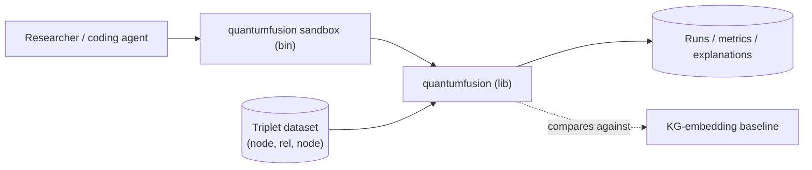
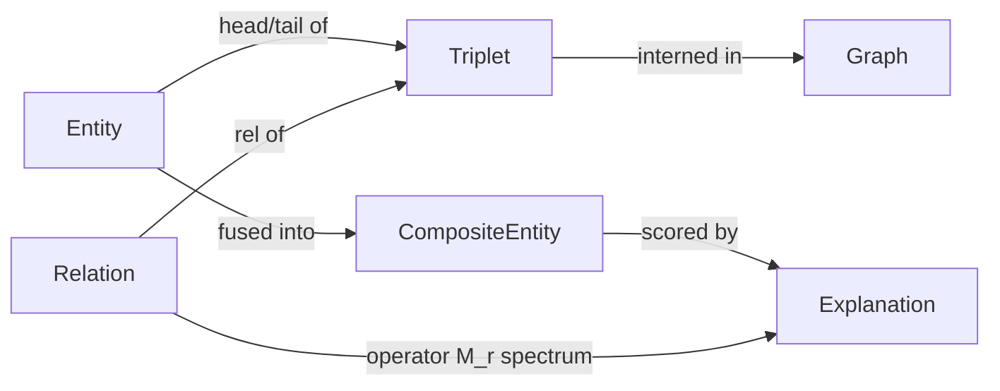

# Architecture

QuantumFusion is a single Rust crate (`quantumfusion`) with two faces: a **library** that
exposes the core types and algorithms for computing over fact triplets, and a **research
sandbox** — a thin binary plus scripted experiments — that drives the library over datasets to
test the eigenspace-orthogonality theory. State is held in memory during a run; datasets and
results are read from and written to disk. There is no long-running service.

Scope is the **algorithm**, not a data-system integration: the crate computes over triplet
datasets. Embedding it in a live knowledge store (continuous curation / integration / query at
scale) is a separate follow-on library (e.g., a GraphForge plugin), out of scope here.

> This describes the intended design for early research. Component boundaries are firm; the
> exact operator family, fusion operator, and scoring function are decisions still being
> validated (see [`adrs/`](adrs/) and [`../REQUIREMENTS.md`](../REQUIREMENTS.md) open questions).

## Context diagram

## Components

| Component | Responsibility | Depends on |
|---|---|---|
| `triplet` | Core types: `Entity`, `Relation`, `Triplet` (with relationship properties + constraints), typed `DataPoint`/`DataType` (point-or-extent, with uncertainty), and an interned `Graph` | — |
| `types` | Per-type native metrics and intra-type analysis (clustering, outlier detection), including extents (spans/areas) and uncertainty, for single-data-type data points | `triplet` |
| `encoders` | Per-type encoders mapping native values (points/extents, with uncertainty) into (a subspace of) the shared space; the bridge that makes heterogeneous facts comparable | `triplet`, `space` |
| `space` | The embedding space: entity vectors, relation operators, and uncertainty; supports **incremental accumulation** (updating with a new fact without a full retrain); load/save | `triplet`, linear-algebra backend |
| `operators` | Relation-as-operator representation and its spectral analysis: eigendecomposition, eigenspaces, invariant subspaces | `space`, linear-algebra backend |
| `orthogonality` | Metrics over subspaces and distributions: principal angles, projection/overlap, containment, and probabilistic (uncertainty-aware) comparison | `operators` |
| `constraints` | Encoding and evaluation of relationship constraints — temporal/geospatial as context-subspaces (overlap queries), arbitrary predicates as explicit gates | `encoders`, `orthogonality` |
| `fusion` | Composite-entity construction: fuse a set of entities/data points into a composite (subspace span / operator combination), propagating uncertainty, and derive candidate facts | `space`, `orthogonality` |
| `discovery` | Scoring + ranking of candidate triplets (existing and composite) with a geometric explanation and derived confidence attached to each | `orthogonality`, `constraints`, `fusion` |
| `hygiene` | Composite hygiene: cluster existing composite entities and flag **duplicates** (near-identical subspaces) and **munged** composites (incoherent/implausible fusions), each with a geometric rationale | `fusion`, `orthogonality`, `types` |
| `eval` | Baselines, accuracy metrics (MRR, Hits@k), **cost/scaling metrics** (time & compute per accumulated fact, per-inference cost vs. graph baseline, knowledge density), composite-hygiene metrics (duplicate/munge precision & recall), uncertainty calibration, reproducible harness | `discovery`, `hygiene`, `triplet` |
| `sandbox` (bin) | CLI entry point: load dataset, run an experiment, emit metrics + explanations | all of the above |

## Data model

The core noun is the **triplet**. Everything else is a representation of, or an operation over,
triplets.

- **DataType** — the kind of a data point: scalar, categorical, ordinal, temporal, geospatial,
  text, boolean, embedding, etc. Each has a native metric used for intra-type analysis.
- **DataPoint** — a typed value (`(DataType, value)`); the smallest unit inside a fact. Every
  data point may be a **point** or an **extent**, and may carry **uncertainty** (see below). A
  single-type data point is cheap to cluster / outlier-detect in its native space.
- **Extent vs. point** — a unifying distinction: a value is either a point (an instant, a
  coordinate, a scalar) or an extent (a temporal *span*, a geospatial *area*, an interval).
  Points encode to vectors; extents encode to bounded regions/subspaces, so span-vs-instant and
  area-vs-point comparisons become containment / overlap / projection.
- **Uncertainty** — an optional distribution over a data point's value (e.g. variance/covariance
  for points, fuzzy membership for extents). It is part of the primitive, not an afterthought,
  and **propagates** through encoding → fusion → scoring so every discovered fact's confidence is
  derived.
- **Entity** — a node identifier plus properties (typed data points) and a learned vector
  `e ∈ ℝⁿ` (or `ℂⁿ` if a complex/unitary operator family is chosen), aggregating its data points
  encoded into the shared space by `encoders`.
- **Place** / **Time** — first-class typed data points: a place is a point or area; a time is an
  instant or span. Both are extents-capable and uncertainty-capable.
- **TypeEncoder** — a per-type map from native values (points or extents, with uncertainty) into
  (a subspace of) the shared space; the mechanism that makes multi-data-type facts comparable
  under one metric.
- **Relation** — an identifier, its own **properties**, and a learned **operator** `M_r` acting
  on the entity space. Its spectral data (eigenvalues, eigenspaces) is the object the theory
  reasons about.
- **Constraint** — a qualification on a relationship instance (temporal span, geospatial area, or
  arbitrary predicate) bounding when/where/under-what-conditions the fact holds. Temporal and
  geospatial constraints are encoded as context-subspaces of the fact so applicability is an
  overlap query; arbitrary predicates remain an explicit gate.
- **Triplet** — `(head: Entity, rel: Relation, tail: Entity)` plus optional relationship
  properties and constraints; the atomic fact and unit of training/evaluation.
- **Graph** — an interned collection of triplets with fast lookup by head/rel/tail; the input
  to a run.
- **CompositeEntity** — a derived entity defined by its constituents and the subspace they span
  (or the operator combination that produced it); carries provenance back to its constituents. A
  **multi-data-type fact is a composite across types**: the subspace it spans is the (ideally
  near-orthogonal) direct sum of its per-type encoded components, so comparison decomposes into
  a holistic score plus a per-type breakdown.
- **Explanation** — the geometric rationale for a scored fact: which eigenspaces, the principal
  angles / orthogonality measures involved, and the resulting confidence.

## Domain language and boundaries

| Domain concept | Meaning in this project | Boundary / owner |
|---|---|---|
| Triplet / fact | `(head, relation, tail)` — the atomic unit of knowledge | `triplet` |
| Data type | Kind of a data point, with its own native metric | `types` |
| Data point | A typed value inside a fact | `triplet` / `types` |
| Multi-data-type fact | A fact carrying data points of different types; hard to compare without a shared space | `encoders` / `fusion` |
| Type encoder | Per-type map from native values into the shared space | `encoders` |
| Extent | A span/area value (vs. a point); encodes to a region/subspace | `types` / `encoders` |
| Uncertainty | Distribution over a data point's value; propagates into confidence | `types` / `fusion` |
| Constraint | Temporal/geospatial/arbitrary qualification bounding when/where a fact holds | `constraints` |
| Relation operator | Linear operator `M_r` representing a relation's action on entities | `operators` |
| Eigenspace | Invariant subspace of `M_r` for an eigenvalue; the theory's primitive | `operators` |
| Orthogonality | Degree to which two subspaces are geometrically independent (principal angles) | `orthogonality` |
| Fusion | Operation combining entities into a composite entity | `fusion` |
| Composite entity | Higher-order entity synthesized from constituents | `fusion` |
| Composite hygiene | Clustering composites to flag duplicates and munged (false-combination) composites | `hygiene` |
| Fact accumulation | Incremental incorporation of a new fact into the shared space | `space` |
| Knowledge density | Ratio of derivable facts to stored facts | `eval` |
| Knowledge discovery | Ranking candidate/created triplets with a geometric rationale | `discovery` |

## Key flows

### Composite entity knowledge creation (the headline flow)

1. Load a triplet dataset into a `Graph` — `triplet`.
2. Learn or load entity vectors and relation operators — `space`.
3. Compute the spectral decomposition of the relevant relation operators — `operators`.
4. Fuse a chosen set of entities into a `CompositeEntity` (span their subspace) — `fusion`.
5. For each candidate relation, measure the orthogonality between the composite's subspace and
   the relation's eigenspaces — `orthogonality`.
6. Rank candidate facts about the composite and attach an `Explanation` to each — `discovery`.
7. Emit results (created facts + rationale + confidence) — `sandbox`.

### Composite hygiene: duplicate & munged-composite detection (the critical sub-focus)

1. Collect the existing `CompositeEntity` set (created or accumulated) and their spanned
   subspaces — `fusion`.
2. Cluster the composites by subspace similarity (principal angles / projection overlap) —
   `orthogonality`, `types`.
3. Flag **duplicates**: composite pairs whose subspaces are near-identical (principal angles ≈ 0)
   — likely the same thing represented twice — `hygiene`.
4. Flag **munged** composites: composites whose spanned subspace is internally incoherent or sits
   implausibly across unrelated eigenspaces — likely a false fusion — `hygiene`.
5. Attach an `Explanation` (the angles/eigenspaces justifying each flag) and emit a ranked
   hygiene report — `hygiene` → `sandbox`.

### Comparing multi-data-type facts

1. Split each fact into its typed data points — `triplet`.
2. Run cheap intra-type analysis (cluster / outlier) in each type's native space where useful —
   `types`.
3. Encode each typed data point into the shared space via its `TypeEncoder` — `encoders`.
4. Assemble each fact's spanned subspace (direct sum of its per-type components) — `fusion`.
5. Compare two facts by principal angles between their subspaces, yielding a holistic score and
   a per-type decomposition — `orthogonality`.

### Incremental fact accumulation (the cost hypothesis)

1. Receive a new fact, including its constraints and any uncertainty — `triplet`.
2. Encode its data points (points/extents, with uncertainty) into the shared space — `encoders`.
3. Update the affected entity vectors / relation operators incrementally, without a full
   retrain — `space`.
4. Record the cost of the update (time, compute) — `eval`.
5. Over a growing stream of facts, compare accumulation + inference cost against a
   graph-traversal / KG-embedding baseline, and track knowledge density — `eval` → `sandbox`.

### Theory validation run

1. Split the dataset into train/test, holding out known facts (including composite ones) — `eval`.
2. Train the space and run discovery over held-out candidates — `space`, `discovery`.
3. Score accuracy against a KG-embedding baseline (MRR / Hits@k) and cost against a
   graph-traversal baseline — `eval`.
4. Report whether orthogonality correlated with fact validity, and whether accumulation cost
   stayed flat/sub-linear as the graph grew — `eval` → `sandbox`.

## Cross-cutting concerns

- **Numerical correctness:** the linear-algebra core is the foundation; decompositions are
  unit-tested against known-good results and checked for stability. Backend choice
  (`nalgebra` / `ndarray` + `ndarray-linalg` / `faer`) is an ADR — see open questions.
- **Reproducibility:** every run is seeded and parameterized by an explicit config so results
  regenerate; run outputs are written with the config that produced them.
- **Configuration:** experiments are driven by config (dataset path, dimensionality, operator
  family, seed) rather than hardcoded constants.
- **Observability:** for a research crate this is run-level — structured logs and per-run
  metrics/artifacts rather than production telemetry. See
  [`OBSERVABILITY.md`](OBSERVABILITY.md).
- **Uncertainty:** data points may carry a distribution; uncertainty propagates through
  encoding, fusion, and scoring so confidence on discovered facts is derived rather than
  asserted. It is a first-class concern, not a downstream annotation.
- **Accumulation cost:** the cost of incorporating a new fact is itself measured (see the
  accumulation flow); the design favors incremental updates over full retraining to keep the
  cost hypothesis testable.
- **Error handling:** library returns `Result` with typed errors (bad dataset, dimension
  mismatch, non-convergent decomposition); the sandbox surfaces them with context.

## Decisions

- _ADR-0001 — [Adopt the eigenspace-orthogonality theory as the core mechanism](adrs/0001-eigenspace-orthogonality-theory.md) (Proposed)_
- _Pending — linear-algebra backend choice_
- _Pending — relation operator family (real matrix vs. orthogonal/unitary/rotation)_
- _Pending — fusion operator definition (subspace span vs. operator composition vs. tensor)_
- _Pending — type-subspace placement: enforce orthogonal per-type subspaces vs. let encoders learn placement and merely measure orthogonality_
- _Pending — uncertainty representation (Gaussian mean+covariance vs. sampling vs. fuzzy membership) and how it propagates_
- _Pending — constraint mechanism (context-subspace overlap vs. score gate) for temporal/geospatial vs. arbitrary constraints_
- _Pending — incremental accumulation strategy (online operator update vs. periodic refit)_

## Risks & trade-offs

- **The core hypothesis may be false.** Eigenspace orthogonality might not predict composite
  facts better than baselines. This is a research risk, mitigated by measuring against baselines
  early and being willing to record a negative result.
- **Composite entities lack ground truth.** Held-out "composite facts" may be scarce, making
  evaluation hard; dataset choice is itself a research decision.
- **Scale.** Eigendecomposition per relation is costly; early work favors small/medium graphs
  over scale.
- **Operator identifiability.** Multiple operator families can fit the same triplets; the
  spectral interpretation is only meaningful if the chosen family is constrained enough.
- **Type-encoder quality.** The whole heterogeneous-comparison story depends on `encoders`
  placing types sensibly. Poor encoders (or forced-orthogonal subspaces that distort a type's
  native geometry) could make cross-type comparison meaningless — mitigated by validating each
  encoder against its native-space intra-type analysis before trusting fused comparisons.
- **Cost hypothesis may not hold.** Incremental accumulation could degrade quality (drift) or
  the linear-algebra ops could themselves grow with dimension/graph, erasing the expected win
  over graph traversal. Mitigated by measuring cost *and* accuracy together as the graph grows.
- **Uncertainty propagation is lossy.** Approximations (e.g. Gaussian assumptions) may
  mis-calibrate confidence; calibration is an explicit success metric, not assumed.
- **"Deeper/denser knowledge" is under-defined.** The value claim depends on definitions still
  being firmed up (see [`../PRODUCT.md`](../PRODUCT.md) success metrics and open questions);
  until then the cost hypothesis is directional, not yet falsifiable.
